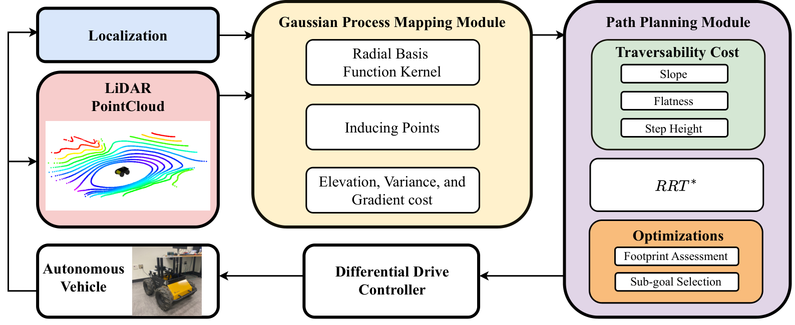
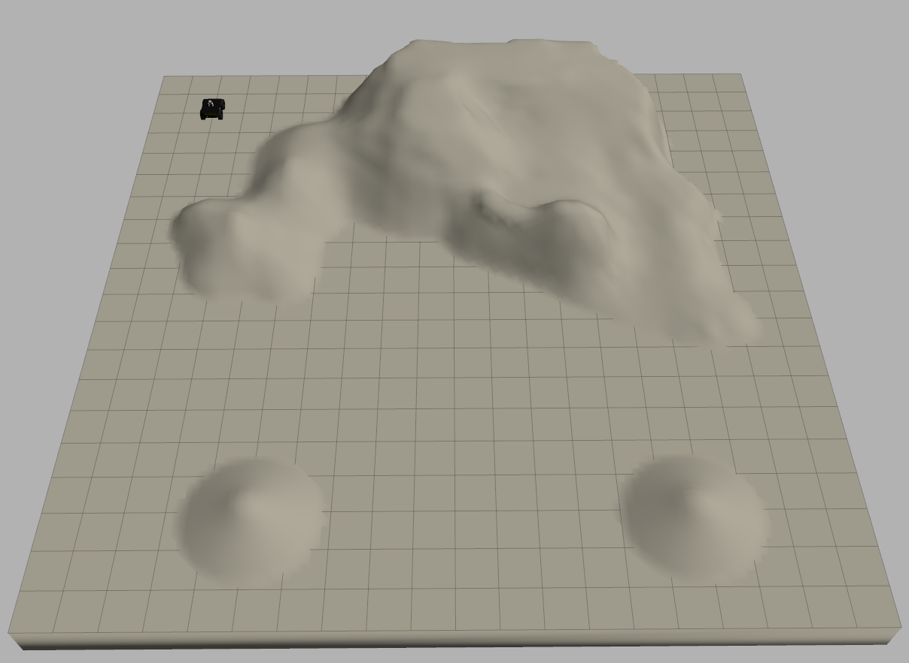
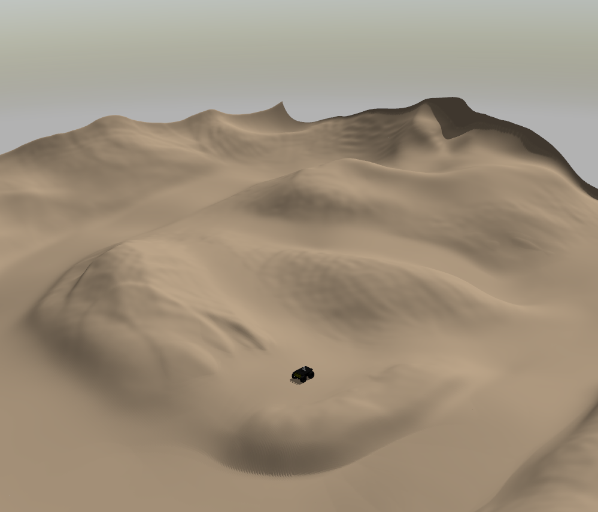
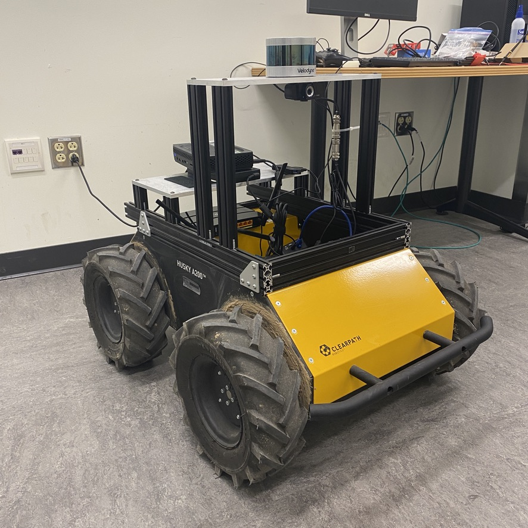
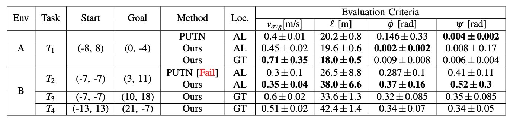

# Gaussian Process-based Traversability Analysis for Terrain Mapless Navigation



- Related Paper: [arXiv Preprint](https://arxiv.org/abs/2403.19010)
- Video Demo: [YouTube](https://www.youtube.com/watch?v=rYURYf1w7f8)

This work has been accepted for publication at 2024 IEEE International Conference on Robotics and Automation. [(ICRA 2024)](https://2024.ieee-icra.org/)

## Table of Contents

- [Installation](#installation)
- [Simulation Setup](#simulation-setup)
- [Running](#running)
- [Module Parameters](#module-parameters)
- [Resources](#resources)
- [Citation](#citation)

## Installation

The code was tested on Ubuntu 20.04, using ROS Noetic, and Python 3.8.10.

1. Clone GitHub Repositories:

```
cd ~/catkin_ws/src
git clone https://github.com/abeleinin/gp-navigation.git 
git clone https://github.com/merose/diff_drive.git
```

Clone the current repository and [merose/diff_drive](https://github.com/merose/diff_drive), which provides a Python differential-drive controller API.

2. Install Python and ROS dependencies:

```
cd gp-navigation
pip install -r requirements.txt
sudo apt install ros-noetic-tf2-sensor-msgs
```

3. Build workspace:

```
cd ../..
catkin_make
source devel/setup.bash
```

## Simulation Setup

### Environments

{:height="50%" width="50%"}
{:height="50%" width="50%"}

We tested our code in 2 Gazebo environments shown above. Originally, environment A is Map 1 from the our baselines repo [(PUTN)](https://github.com/jianzhuozhuTHU/putn). Environment B was chosen as a more challenging terrain with less flat areas. The [worlds/](worlds/) and [models/](models/) files are provided in this repo.

### Robot Platform

{:height="80%" width="80%"}

The [Clearpath Robotics](https://clearpathrobotics.com/) Husky robot was used during testing. We also include launch files to run our method with the Jackal robot. The LiDAR sensor we use is the Velodyne VLP-16.

### A-LOAM

We utilized the same A-LOAM implementation our baseline method [(PUTN)](https://github.com/jianzhuozhuTHU/putn) used, which is [HKUST-Aerial-Robotics/A-LOAM](https://github.com/HKUST-Aerial-Robotics/A-LOAM).

Since, the repo was created prior to ROS Noetic's release, but we we're still able to make it work with the following dependency version. We fould that [ceres solve version 2.0.0](https://github.com/ceres-solver/ceres-solver/releases/tag/2.0.0) works and using the following [installation guide](http://ceres-solver.org/installation.html#linux).

## Running

Here is a demo of how you'd launch and run Task 3 from our paper:

1. Spawn Husky into Environment B at the starting location:

```
roslaunch gp_navigation husky_gazebo.launch env:=env_b x:=-7 y:=-7 z:=-5.2
```

Use the `env` argument to chose the environment (default: `env_a`).

2. Next, use the corresponding `gp_navigation_{robot}_{env}.launch` file to launch our method with the appropriate robot and environment configurations:

```
roslaunch gp_navigation gp_navigation_husky_env_b.launch
```

In RViz you can use the `2D Nav Goal` tool to select a goal. To send more precise goals you can publish a Pose to the topic `/plan_path_to_goal` as shown below:

```
rostopic pub --once /plan_path_to_goal geometry_msgs/PoseStamped "header:
  seq: 0
  stamp:
    secs: 0
    nsecs: 0
  frame_id: 'world'
pose:
  position:
    x: 10.0
    y: 18.0
    z: 0.0
  orientation:
    x: 0.0
    y: 0.0
    z: 0.0
    w: 1.0"
```

## Results



Our baseline comparison was [PUTN: A Plane-fitting based Uneven Terrain Navigation Framework](https://arxiv.org/abs/2203.04541). The authors released their code here on GitHub: [jianzhuozhuTHU/putn](https://github.com/jianzhuozhuTHU/putn). We we're able to out perfrom their method in Task 2, which involved traversing the more challenging Environment B.

## Module Parameters

All the parameters for our method is stored in the [config/](config/) directory. **Click to expand** for parameter descriptions:

<details>
<summary>GP Mapping Module Parameters</summary>

GP Mapping configs located in [config/gp_module/](config/gp_module/).

| Name         | Description | Default |
|--------------|-------------|---------|
| length_in_x  | map size in the x-axis | 10.0 |
| length_in_y  | map size in the y-axis | 10.0 |
| resolution | Pixel density of maps grids | 0.2 |
| inducing_points | Subset of points to train GP model on | 500 |

</details>

<details>
<summary>Path Planning Module Parameters</summary>

Path Planning configs located in [config/path_planning/](config/path_planning/).

| Name         | Description | Default |
|--------------|-------------|---------|
| step_len | Length of RRT* branching | 0.5 |
| iter_max | Maximum interations of RRT* | 1000 |
| radius | Circle about the robot, usually half the map size | 5.0 |
| trav_limit | Threshold for traversability safety | Determines how agressive to plan. |
| replan_dist | Distance to sub-goal before initiating replanning | Map size and compute dependent. |
| critical | Limitation on what the robot can safely traverse | Environment and robot dependent. |
| trav_weights | Weighting coefficients to determine their impact on traversability calculation | Environment and robot dependent. Weights should sum to 1. |
| sub_goal_weights | Weighting for sub-goal selection method | Environment and robot dependent. Weights should sum to 1. |

</details>


## Citation

If you find this code or our work valuable, please cite:

```
@article{leininger2024,
  title={Gaussian Process-based Traversability Analysis for Terrain Mapless Navigation},
  author={Leininger, Abe and Ali, Mahmoud and Jardali, Hassan and Liu, Lantao},
  journal={arXiv preprint arXiv:2403.19010},
  year={2024}
}
```

